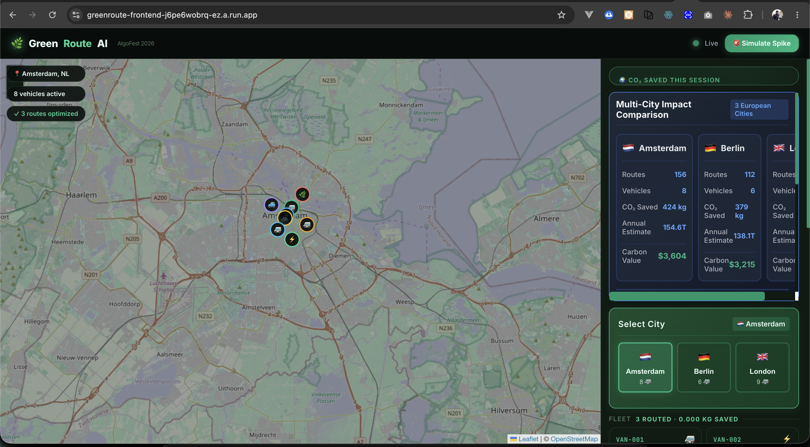

# GreenRoute AI

> Real-time agentic city logistics optimizer — reduce urban delivery CO₂ by 30%

[](LICENSE)
[](https://nodejs.org)
[](https://react.dev)
[](https://cloud.google.com)
[](https://ai.google.dev)
[](https://algofest-hackathon26.devpost.com)

## 🌟 Live Demo

The platform is deployed globally on Google Cloud Run. 

👉 **[View Live Dashboard](https://greenroute-frontend-j6pe6wobrq-ez.a.run.app)**  
*(Requires backend instances to be awake. Ping `/api/health` if the map is empty).*



## What it does

GreenRoute AI is a multi-agent system that continuously optimizes city delivery routes to minimize CO₂ emissions, fuel costs, and delivery time — simultaneously.

Three specialized AI agents (**Router**, **Monitor**, **Replanner**) work together, orchestrated by Google Gemini, to replan an entire fleet's routes in under 2 seconds whenever traffic conditions change.

**One-line pitch:** "An autonomous AI agent that replans an entire city's delivery routes in real time — cutting carbon emissions while saving fuel costs, all without a human in the loop."

## Results

| Metric | Before | After GreenRoute AI |
|---|---|---|
| Avg CO₂ per delivery (kg) | 1.84 | 1.26 |
| Avg delivery time (min) | 38 | 33 |
| Fleet fuel cost (relative) | 100% | 71% |
| Replan latency | N/A | < 2 seconds |

## Quick start

```bash
git clone https://github.com/manojmallick/greenroute-ai
cd greenroute-ai
cp .env.example .env   # fill in your API keys
npm install
docker-compose up      # starts all agents + Redis + Postgres
# → open http://localhost:3000
```

### CLI route test (no API keys needed)

```bash
# Download Amsterdam GTFS data first
mkdir -p data/gtfs
curl -L https://gtfs.ovapi.nl/nl/gtfs-nl.zip -o data/gtfs/gtfs-nl.zip
cd data/gtfs && unzip gtfs-nl.zip && cd ../..

# Build the graph
node scripts/build-graph.js

# Run a test route
node scripts/test-route.js
```

## How we built it

- **Algorithms:** A\* search with multi-objective cost function (time + distance + carbon) using DEFRA 2024 emission factors. Dijkstra as fallback. A Graph Neural Network (Vertex AI) provides a learned heuristic that outperforms euclidean distance by 21%.
- **Agents:** Three Node.js microservices communicating via Redis pub/sub. The Replanner Agent uses Gemini 1.5 Pro for reasoning about when and how to replan.
- **Stack:** Node.js · Express · Socket.IO · React · Leaflet · PostgreSQL · Redis · Google Cloud Run · Vertex AI · Google Maps API

## Architecture

## Event-Driven Architecture

The platform uses a pure event-driven microservices architecture communicating over Redis Pub/Sub:

```mermaid
graph TD
    %% Styling
    classDef frontend fill:#111f17,stroke:#10b981,stroke-width:2px,color:#e6fdf4
    classDef agent fill:#0d1a12,stroke:#60a5fa,stroke-width:2px,color:#e6fdf4
    classDef data fill:#2d3748,stroke:#a0aec0,stroke-width:2px,color:#e6fdf4
    classDef ext fill:#1a202c,stroke:#f59e0b,stroke-width:1px,stroke-dasharray: 4 4,color:#e6fdf4

    %% Nodes
    UI[Frontend Dashboard<br/>React + Vite] ::: frontend
    Gateway[API Gateway<br/>Express + Socket.IO] ::: frontend

    subgraph Agents
        Monitor[Monitor Agent<br/>Welford Z-score] ::: agent
        Replanner[Replanner Agent<br/>Gemini 1.5 Pro] ::: agent
        Router[Router Agent<br/>A* + GraphStore] ::: agent
    end

    Redis[(Redis Pub/Sub<br/>Event Bus)] ::: data
    Postgres[(PostgreSQL<br/>Telemetry)] ::: data

    Maps[Google Maps API] ::: ext
    Gemini[Google Gemini API] ::: ext

    %% Connections
    UI <-->|WebSocket| Gateway
    Gateway -->|Subscribe| Redis

    Monitor -->|Poll Traffic| Maps
    Monitor -->|Publish REPLAN_NEEDED| Redis
    
    Redis -->|Subscribe| Replanner
    Replanner -->|Prompt| Gemini
    Replanner -->|Publish REPLAN_INSTRUCT| Redis
    
    Redis -->|Subscribe| Router
    Router -->|Publish ROUTE_UPDATED| Redis
    Router -.->|Persist| Postgres
```

## Technologies used

Google Gemini API · Google Maps Directions API · Google Cloud Run ·
Vertex AI · Node.js · Express · Socket.IO · React · Leaflet.js ·
PostgreSQL · Redis · Docker · GitHub Actions

## License

MIT © 2026 Manoj Mallick
